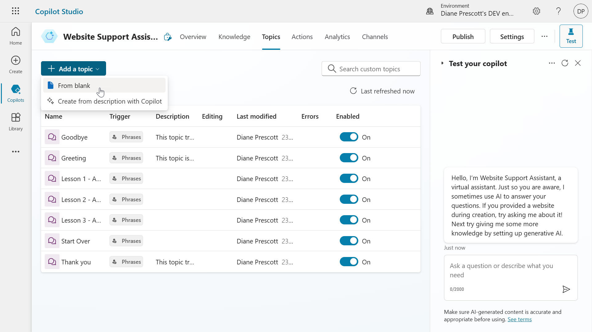
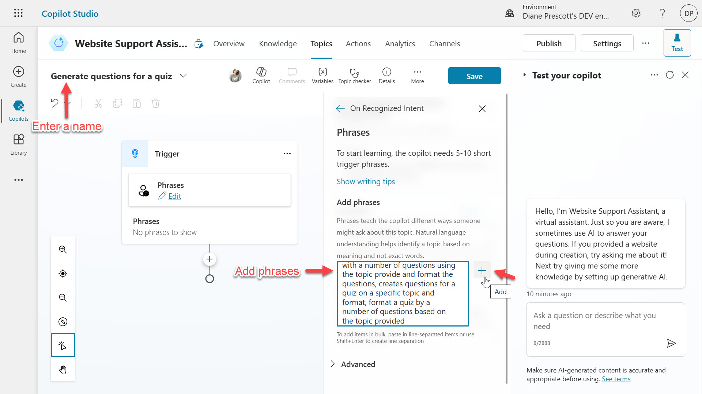
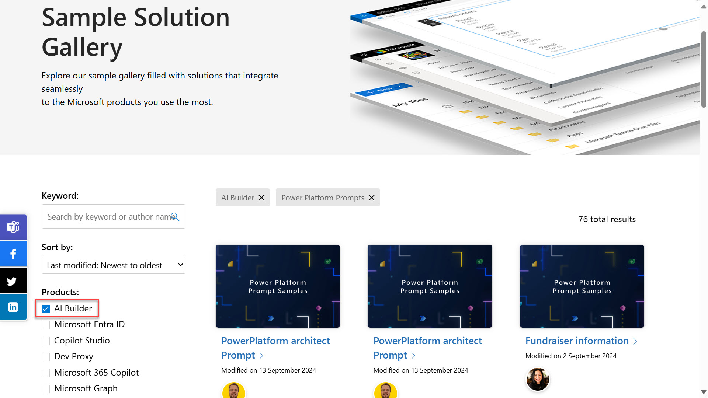
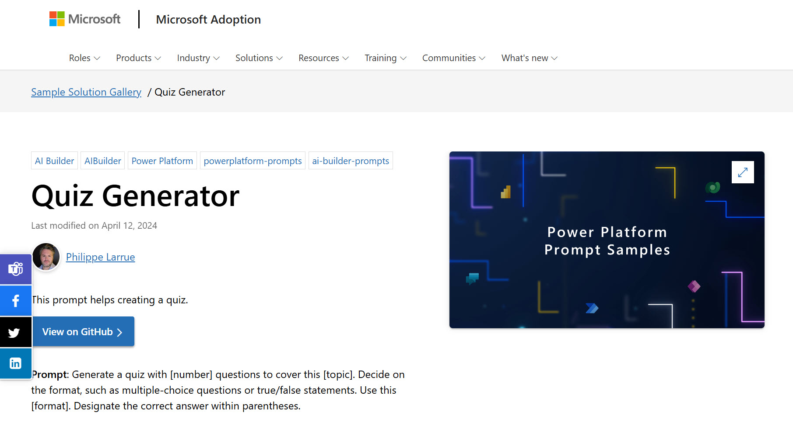
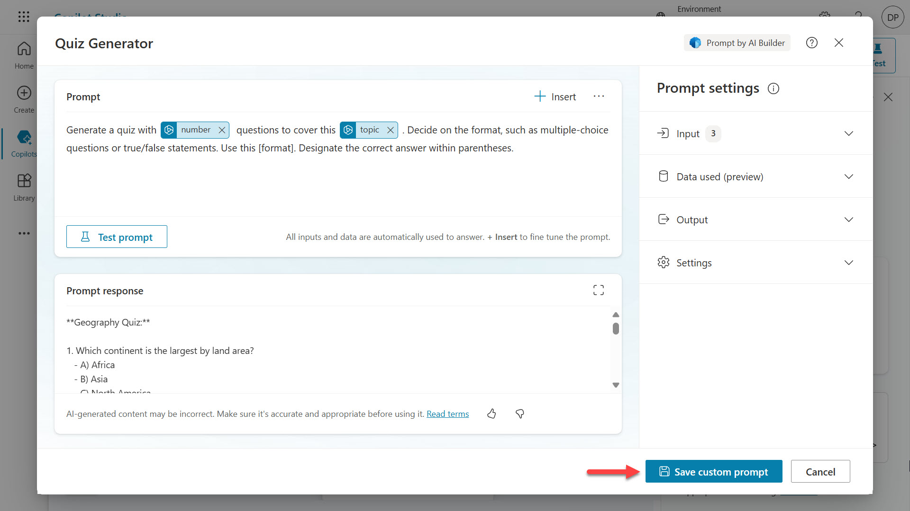

# Lab 03 - Create a Prompt action using a Power Platform connector for generative responses

Actions can be used to extend the capabilities of agents. You can add multiple types of actions to your agents in Microsoft Copilot Studio:
- **Prebuilt connector action**, which use Power Platform connectors to access data from other systems, such as popular enterprise products like Salesforce, Zendesk, MailChimp, and GitHub.
- **Custom connector action**, where a connector can be built to access data from public or private APIs.
- **Power Automate cloud flow**, which use Power Automate flows to perform actions, and retrieve and work with data.
- **AI Builder prompts**, which use AI Builder and natural language understanding to target the specific scenarios and workflows within your business.
- **•	Bot Framework skill**, which use the skill manifest that outlines the actions the skill can perform, including its input and output parameters, the skill's endpoints, and dispatch models for the skill.

In this lab, you will learn how to do the following:
* [3.1 Add a prompt to a topic node](#31-create-a-prompt-plugin-for-generative-actions)

## 3.1 Add a prompt action to a topic node

In this part of the lab we’ll be creating a **prompt action** in a topic., which is the **Generate content or extract insights** action from the AI Builder connector.

Prompt actions in topics help guide the agent's response in a semi-scripted conversation by using the generative AI models from AI Builder and natural language understanding to address specific scnarios for your agents.

For this lab, we'll add a Topic that calls a prompt action to generate questions for a quiz.

1.	In your agent select the **Topics** tab, select **+ Add a topic** and select From blank.

    

1. Enter a **name** for the Topic such as `Generate questions for a quiz` and select the **Edit** hyperlink under Phrases in the trigger. A minimum of 5 trigger phrases needs to be entered and you can enter them in bulk by pasting in line-separated items and then select the **+** icon to add the phrases.

    The following is an example that can be copied and pasted.

    ```
    Create a number of questions for a quiz based on a topic and format the quiz based on the instruction provided, creates a quiz with a number of questions based on the topic provided and formats the quiz, generate a quiz with a number of questions using the topic provide and format the questions, creates questions for a quiz on a specific topic and format, format a quiz by a number of questions based on the topic provided
    ```  

    

1. Select **Save** on the top right of the authoring canvas to save the Topic.

    

1. Under the trigger node, select the **+** icon and select the Call an action node, followed by selecting Create a prompt.

    

1.  The Prompt dialog will appear, and you may see a flyout appear that will guide you on how to create your prompt. Select **Next** to go through the guide.

    

1. Let's take a moment to familiarize ourselves with the Prompt dialg. You’ll see the following:
    - **Name** of the prompt on the top left
    - **Prompt settings** on the right hand side which contains
        - **Input** where the inputs parameters for the prompt can be added or deleted.
        - **Data used (preview**) where you can use your own data from Dataverse tables in a prompt.
        - **Output** where you define the response to be returned as text or JSON (preview).
        - **Settings** where you define the GPT model to be used for generating responses and the temperature slider allows you to select the temperature to control the randomness of the output generated by the AI model, [learn more](https://learn.microsoft.com/en-us/ai-builder/prompt-modelsettings).
    - **Prompt** on the top left hand side which is where you can enter your prompt. You can also start by using the suggested prompts, and test the prompt.
    - **Prompt response** on the bottom left hand side which displays the response generated based on the prompt.

    

1.	Enter a name for the prompt such as `Quiz Generator` 

    

1.	Instead of creating a custom prompt from scratch or using a template, a prompt from the [**Power Platform Prompt Samples**](https://aka.ms/power-prompts) library can be used. In a new browser tab, navigate to [https://aka.ms/power-prompts](https://aka.ms/power-prompts) and filter to _AI Builder_ by ticking the checkbox on the left hand side.

    

1.	Select the [Quiz Generator Prompt](https://adoption.microsoft.com/en-us/sample-solution-gallery/sample/pnp-powerplatform-prompts-quiz-generator/). This prompt will generate a quiz based on three input parameters, 
    - number which is the number of questions
    - topic which is the topic of the quiz
    - format which is the output format of the questions

    Copy the prompt.

    

1.	Go back to the action in Copilot Studio. Paste the copied prompt value in the Prompt box on the top left hand side.

    

1.	Expand the **Input** section and select **+ Add input**.

    

1.	Enter a name for the first input of `number` and enter sample data such as `5`

    

1.	Repeat the same for the second and third input of topic and format. Make sure you provide sample data.

    

1.	Next, the inputs needs to be inserted into the prompt. In the Prompt, highlight **[number]** and select **+ Insert** and select **number**. The input of number has now been added to the prompt as an input. Repeat the same steps for the remaining inputs.

    

1. Test the prompt before saving the custom prompt. Select **Test prompt** and a response to the prompt regarding the values provided in the sample data of the input is returned. You can also **maximize** the prompt response box to enlarge the prompt response dialog.

    

1. Since we're not covering Dataverse in this workshop, the **Data used (preview)** does not need to be updated in the **Prompt settings**. The **Output** can be left as the default which is Text, and the **Settings** can be left as the default.

    Let's now save the prompt by selecting **Save custom prompt**

    

OLD

Select **Library** in the left-hand side menu, select **Add an ttem** and select **Copilot for Microsoft 365**.

    

1.	Select **Prompt**.
    
    

1.  The Prompt dialog will appear, where you’ll see the following
    - **Name** of the prompt on the top left
    - **Prompt settings** on the right hand side which contains
        - **Input** where the inputs parameters for the prompt can be added or deleted.
        - **Data used (preview**) where you can use your own data from Dataverse tables in a prompt.
        - **Output** where you define the response to be returned as text or JSON (preview).
        - **Settings** where you define the GPT model to be used for generating response and the temperature slider allows you to select the temperature of to control the randomness of the output generated by the AI model, learn more.
    - **Prompt** on the top left hand side which is where you can enter your prompt. You can also start by using the suggested prompts, and test the prompt.
    - **Prompt response** on the bottom left hand side which displays the response generated based on the prompt.

    

1.	Enter a name for the prompt such as `Quiz Generator` 

    

1.	Instead of creating a custom prompt from scratch or using a template, a prompt from the [**Power Platform Prompt Samples**](https://aka.ms/power-prompts) library can be used. In a new browser tab, navigate to [https://aka.ms/power-prompts](https://aka.ms/power-prompts) and filter to _AI Builder_ by ticking the checkbox on the left hand side.

    

1.	Select the [Quiz Generator Prompt](https://adoption.microsoft.com/en-us/sample-solution-gallery/sample/pnp-powerplatform-prompts-quiz-generator/) and copy the prompt.

    

1.	Go back to the action in Copilot Studio. Paste the copied prompt value in the Prompt box on the top left hand side.

    

1.	Expand the **Input** section and select **+ Add input**.

    

1.	Enter a name for the first input of number and enter sample data such as `5`

    

1.	Repeat the same for the second and third input of topic and format. Make sure you provide sample data..

    

1.	Next, the inputs needs to be inserted into the prompt. In the Prompt, highlight **[number]** and select **+ Insert** and select **number**. The input of number has now been added to the prompt as an input. Repeat the same steps for the remaining inputs.

    

1.	Test the prompt before saving the custom prompt. Select **Test prompt** and a response to the prompt regarding the values provided in the sample data of the input is returned. You can also **maximize** the prompt response box to enlarge the prompt response dialog.

    

1.	Select **Finalize prompt**. Review the prompt, if any changes need to be made select **Back** otherwise select **Create prompt action**.
    
    

1.	The prompt will be created as an action and will display in the library.

    

1.	Select **Copilots** in the left hand side menu and select the _Webiste Q&A and HR Support_ copilot you built previously. Select **+ Add action**.

    

1.	Enter the name of your prompt in the search field. Your prompt action will be displayed. Select your prompt action.
    
    

1.	On the final step of the action wizard, called _Review and Finish_, you can make changes to your action's configuration by clicking **Edit** next to the appropriate section. Usually, the name and description are prepopulated for you based on the action you selected.

    Next, add the inputs and output for the action. Scroll down to Review inputs and outputs and select **Edit**.

    

1.	Select **Add** and select the input of **number**.

    

1.	The **Display name** and **Description** properties for each input help the copilot understand the purpose of the input, to generate an appropriate question for the user, and to recognize the correct value in a user's response. Enter a description such as,

    ```
    The number of questions for the quiz
    ```

    

1.	Repeat the same steps by adding the remaining two inputs of Topic, Format, and providing descriptions.

    - **Topic** – the Topic of the quiz
    - **Format** – the format of questions for the quiz

    

1.	The inputs have now been defined, select **Back** on the bottom left.

    

1.	Next, review the output values by selecting the Outputs tab. There will be two outputs displayed which are the properties of the response returned from the prompt action that uses the AI Builder connector. _Text_ is the value of prompt response generated by the AI Builder connector based on the inputs of number, topic and format.

    

1.  Select Edit to review additional configuration options. These can be left as-is.
    - Respond to the user after running this action is ticked by default.
    - How do you want to display information to the user? allows you to modify how the result should be returned. By default the first one in the following list is selected,
        - AI dynamically generates a message (default)
        - AI dynamically generates an adaptive card from an example you create – this is currently disabled and will be available in the future
        - You create a message
        - You create an adaptive card

    Select Back.

    

1.  Select Finish.

    

1.  The prompt action has now been added as a plugin action to your Copilot.

    

1.  To test the plugin action, the setting of **Generative (preview)** needs to be enabled which allows your Copilot to use generative AI to use the prompt action to respond to the user when asking a question related to creating a quiz. Select **Settings** at the top right.

    

1.  Select **Generative** on the left hand side menu and select the Generative (preview) option and select save.

    

1.  Exit out of settings by selecting the **X** icon.

    

1.  Select **Test** on the top right to load the _test copilot pane_.

    

1.  Select the **map icon** to view the conversation map to follow along your test conversation.

    

1. Enter the following prompt,

    ```
    Can you please generate a quiz with 5 questions on geography and format as multiple choice questions
    ```

    

1.  In the conversation map view, the action for the custom prompt will be triggered and the input values are populated. This is due to the display name and description of the inputs that help copilot understand the purpose of the inputs, it recognizes the values to be used by the prompt action powered by AI Builder.

    

1.  After a few seconds, an answer is returned from the AI Builder action of the custom prompt in plain natural language and is populated in the text output as seen in the conversation mapping view.

    

## Next lab

Congratulations! 🙌🏻 You’ve now learnt how to create a prompt action by creating a custom prompt with one of the Power Platform Prompt samples, and how to add this to your custom copilot.

This is the end of Lab 03 - Create a Prompt action using a Power Platform connector for generative responses, select the link below to move to the next lab.

[⏭️ Move to Lab 04 - Create a custom topic with a prompt action for generative responses](../lab-04/README.md)

