# Lab 04 - Automation for your agent with Power Automate cloud flows

## What are connectors?

Connectors from Microsoft Power Automate are a proxy or "wrapper" around an API that allows the underlying service to talk to Microsoft Power Automate, Microsoft Power Apps, and Azure Logic Apps. Connectors let you connect your accounts and use a set of prebuilt actions and triggers to build your apps and workflows.

With connectors you can access various services (both within the Microsoft ecosystem and outside it) to perform a wide array of tasks automatically.

There are many connectors available, ranging from connections between and to Microsoft services like Office 365, SharePoint, and Dynamics 365, all the way to connections to third-party services like Twitter, Google services, Salesforce, and more. 

These connectors are categorized as:
- **Standard Connectors**  which are available in most Power Automate plans
- **Premium Connectors** which require specific Power Automate plans
- **Custom Connectors** which let you connect to any publicly available API for services not covered by existing connectors

## How do connectors work with Microsoft Copilot Studio?

Microsoft Power Automate connectors help extend the functionality of Microsoft Copilot Studio, enabling them to perform a wide range of tasks by connecting with various external services and applications. This integration empowers agent makers to create more dynamic, responsive, and useful agents, tailored to specific business needs and processes.

You can use connectors that already exist in your Power Apps environment or create a flow from the Microsoft Copilot Studio authoring canvas through the Call an action node.

In this lab, you will learn how to do the following:
* [4.1 Create a Power Automate cloud flow for your agent](#41-create-a-power-automate-cloud-flow-for-your-agent)

## 4.1 Create a Power Automate cloud flow for your agent

In this part of the lab you’ll learn how to add some additional logic and automation. 

A question will be added to the authoring canvas to ask the user if they want to send the questions generated for a quiz to a channel in Microsoft Teams for members of the channel to review.

- Should the user select Yes, a Power Automate cloud flow will be executed to send a Microsoft Teams message to your manager where the message content includes the prompt response from the plugin action.

- Should the user select No, a new node will be added to redirect to the *End of Conversation* node.

Let's begin with creating a Power Automate cloud flow to the existing topic created in [Lab 03 - Create a Prompt action using a Power Platform connector for generative responses](../lab-03/README.md)

1.	Click on the **X** icon to close the testing pane to increase the width of the authoring canvas.

    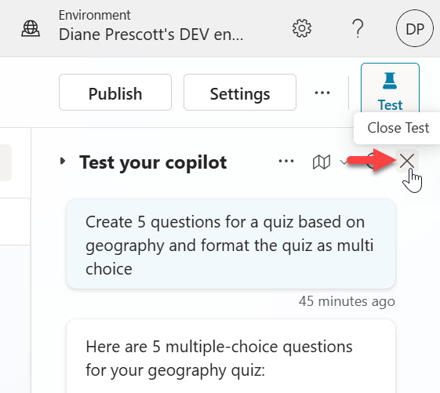

1.	Scroll down to the bottom of the prompt action and select the **+** icon in the authoring canvas to add a new node. Select **Ask a question**.

    

1.	Enter a question such as, 

    ```
    Do you want me to post a message to the General channel in the Contoso Microsoft Teams Group to ask the channel members to review the questions for the quiz?
    ```
    
    

1. Select **+ New option** to add the options of **Yes**, **No**. Next select **Var**1** in the **Save user response as** field

    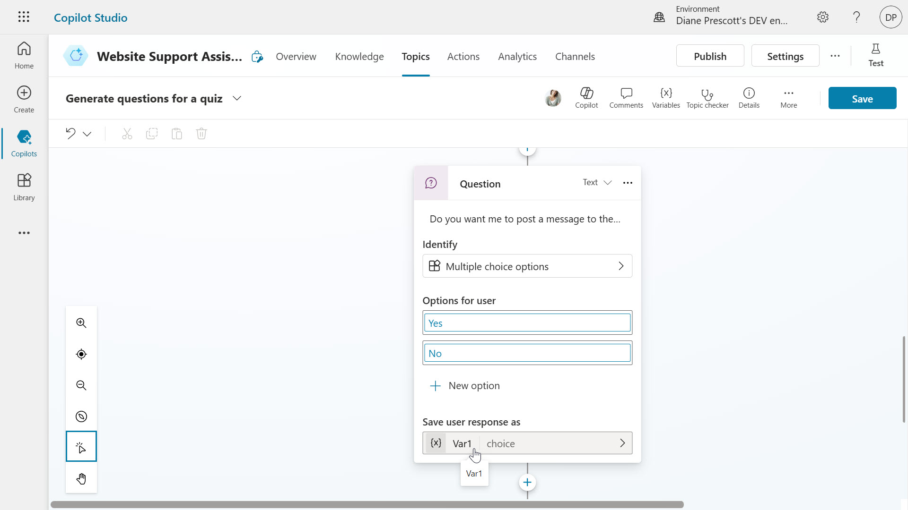

1.	Update the name to **VarSendMessage** and select the **X** icon to close the variables pane.

    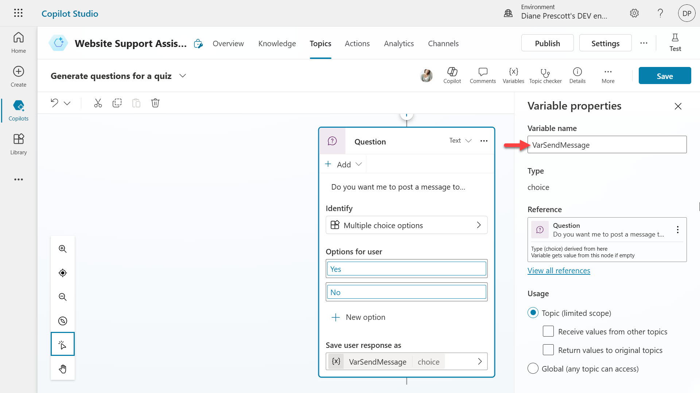

1.	Scroll down in the authoring canvas and under the **Condition** where the **VarSendMessage is equal to Yes**, select the **+** icon in the authoring canvas to add a new node. This time select **Call an action** and select **Create a cloud flow**

    

1.	The Power Automate maker portal will load in a new browser tab. Enter a name for the cloud flow such as, 

    ```
    Send Teams message with the prompt response of quiz questions
    ```
    

1.	Next, an input value needs to be added to the trigger. The value will be passed from the agent to the cloud flow. Select the **Run a flow from Copilot** triger and select **+ Add an input** followed by selecting **Text**. Enter `text_generated` as the name of the input and select the **<** icon to collapse the trigger editing pane.

    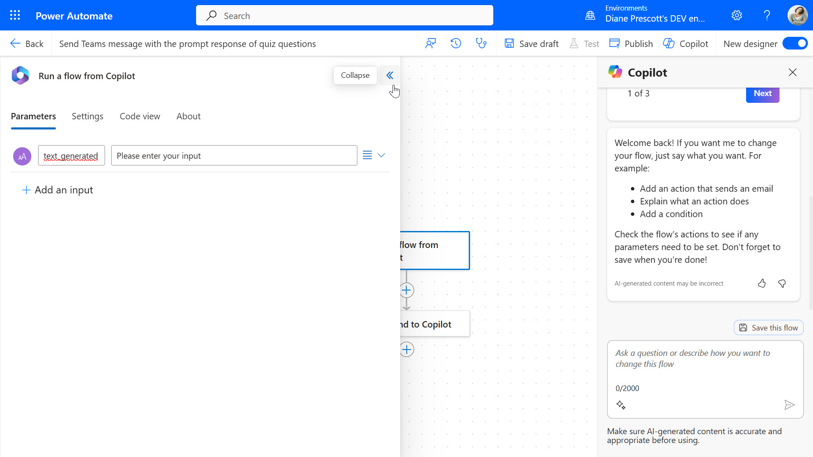

1.	Below the trigger, select the **+** icon on the cloud flow designer canvas, select **Add an action** and enter **Post a message in a chat or channel** to search for the Microsoft Teams action. Select the **Post a message in a chat or channel** action.

    

1.  Create a connection for the Teams connector by selecting **Sign in** and sign in using your credentials.

    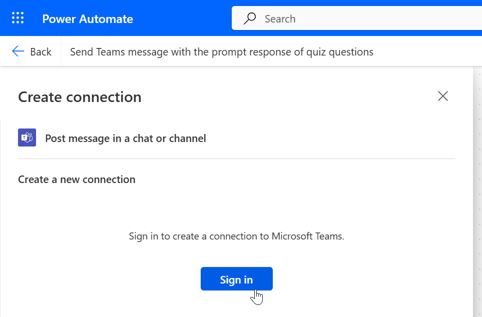

1.	Select the following in the input parameter fields,
    | Field | Value | Note |
    | --- | --- | --- |
    | Post As | Flow bot | |
    | Post In | Channel | |
    | Team | Contoso | You may not see this Team, select any suitable team |
    | Channel | General | You may not see this channel, select any suitable channel for the Team previously selected |
    | Message | [Content of your choice] | Enter a description message for the users in the Teams channel and select the **thunder** icon to insert the text generated output from the trigger of the cloud flow into the message content.|

    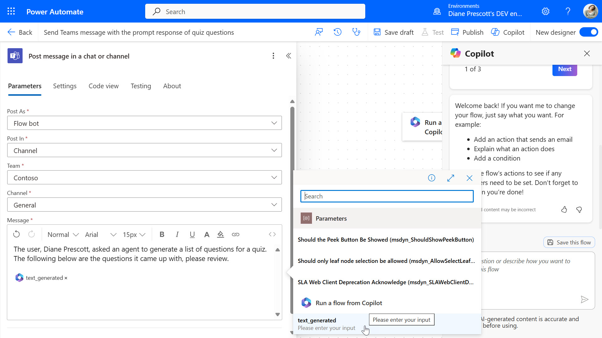

1.	To complete the end user experience, the cloud flow can send a link to the posted Teams message to the user in copilot as a response. Select the last action in the cloud flows, **Return value(s) to Power Virtual Agents** and select **+ Add an output**. 

    

1.	Select **text** as type of output, enter message link as the name of the output. In the value field, select the **thunder** icon and select the **Message Link** output from the **Post message in a chat or channel action**.

    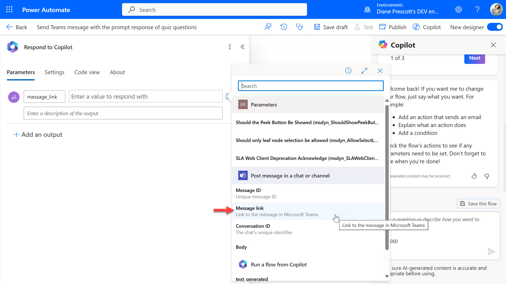

1.	The output value is now updated with the **Message Link** output from the **Post message in a chat or channel action**. Select **Save draft** on the top right hand side of the cloud flow designer.

    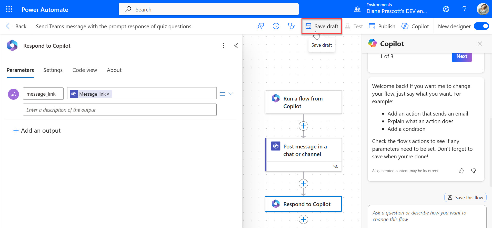

1.	Wait until you receive the confirmation message that the cloud flow has been saved. Next select Publish.

    

1.	Wait until you receive the confirmation message that the cloud flow has been published.

    

1.	Navigate back to the browser tab with Microsoft Copilot Studio and select **Done**.

    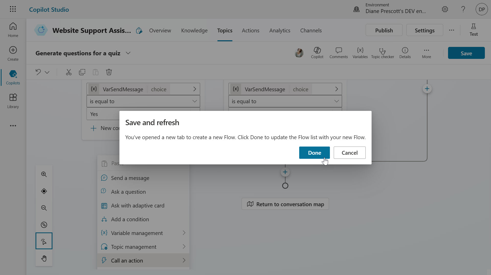

1. The cloud flow will now appear. Select the cloud flow.

    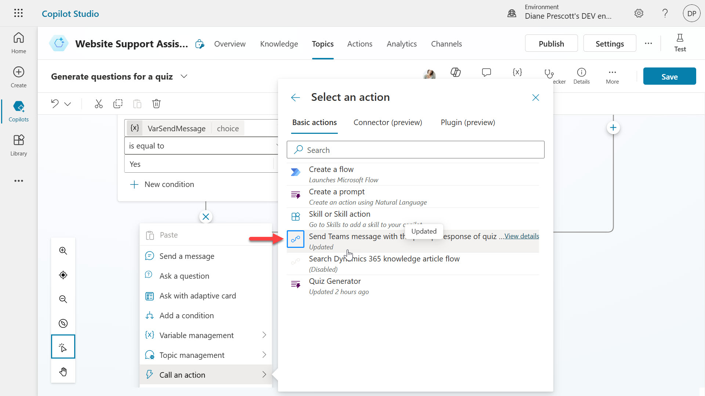

1.	In the Power Automate action node, select the **>** icon for the input and select **VarQuizQuestionsResponse.text**. This is the text property of the prompt response which is saved in the action output variable created earlier. This is the value to use for the input parameter of trigger.

    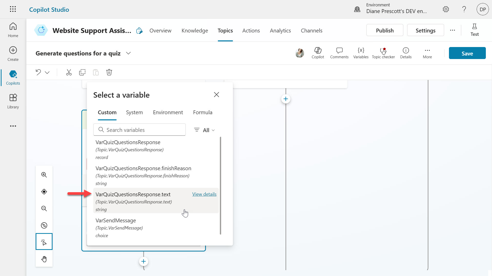

1.	Select the **+** icon in the authoring canvas to add a new node. This time select **Send a message**

    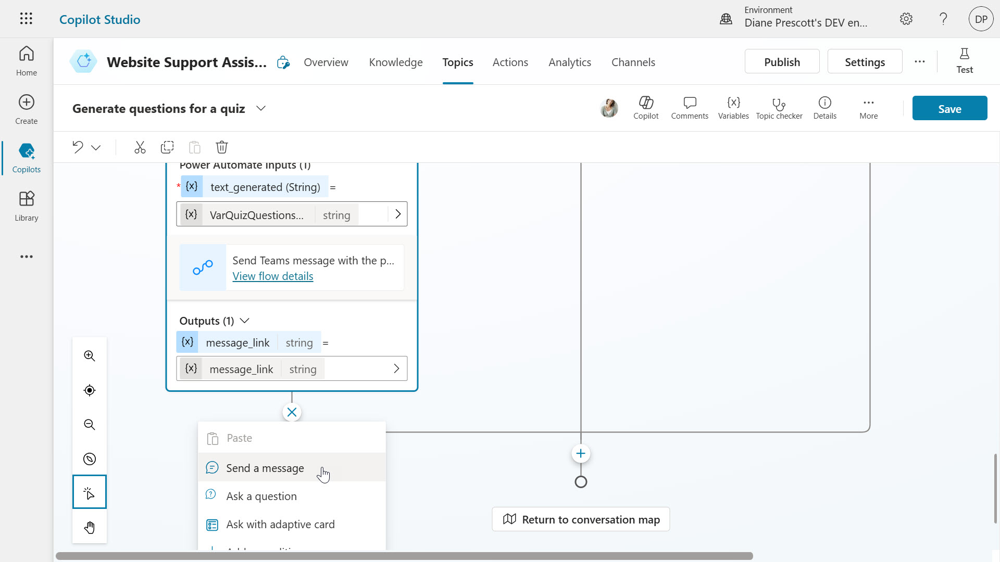

1.	Enter a **message** and then select the **{x}** icon.

    Example message:

    ```
    Great, I posted a message to the Teams channel. Here's the link to the message - 
    ```
    
    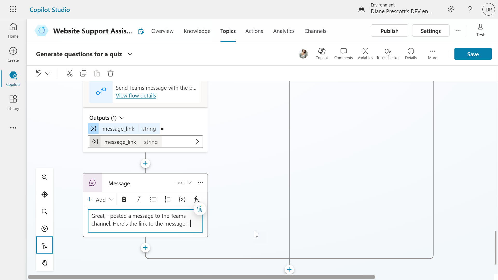

1. In the **Custom tab** of the variables fly-out pane, select **message_link**. This is the output value from the last action of the Power Automate cloud flow.

    

1.	Select **Save** on the top right hand side of the authoring canvas to save the topic.

    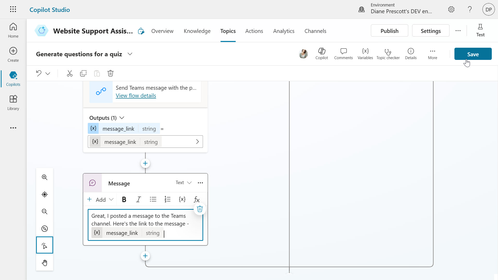

1. Next, we need to configure the last node of the topic. Scroll down and in the last node, selet the **+** icon, select **Topic management**, then select **Go to another topic**, followed by selecting **End of Conversation**. This will redirect to the End of Conversation node.

    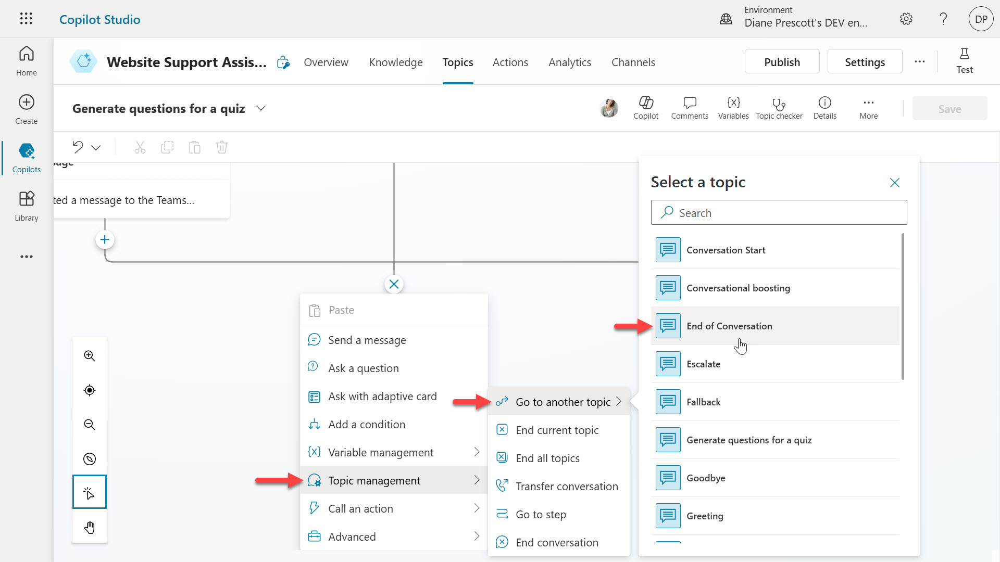

1.	Select **Save** on the top right hand side of the authoring canvas to save the topic.

1.	Select **Test** to load the testing pane and select the **refresh** icon in the chat user interface, enter the following prompt and submit. 

    ```
    Create 5 questions for a quiz based on geography and format the quiz as multi choice
    ```

    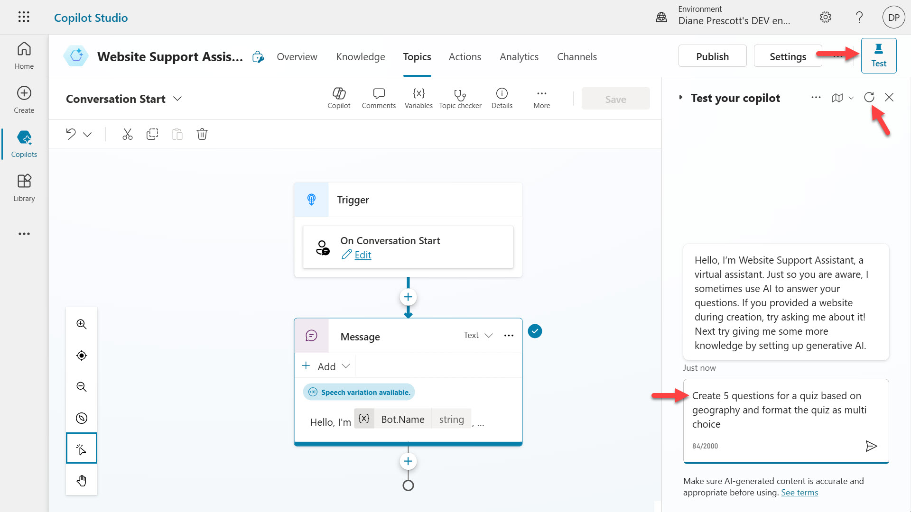

1.  Copilot will return a response and you’ll now see a message with a question including two options for you to select. Select **Yes**

    

1.	A message will appear as additional permissions need to be granted to run the Teams connector from the copilot. Select Connect 

    

1. Select the **cog wheel** icon.

    

1.  Next select **Submit** to enable a connection to Microsoft Teams connector.

    

1.  The action will now have a status of **Connected**.

    

1.  Navigate back to the browser tab with Microsoft Copilot Studio and select Retry.

    

1.  Copilot will execute the Power Automate cloud flow node which results in the cloud flow being triggered and performing the action of posting a message to the **General** channel in Microsoft Teams where the content includes the prompt response. Copilot will then send a message back to the user which contains a link to view the message posted in the Teams channel.

    

1.  Click on the link and open Microsoft Teams in the web app. The posted Teams message created from the cloud flow will appear.

    

## End of lab and workshop

Congratulations! 🎇 You’ve now learnt how to create a Power Automate cloud flow to perform automation where the prompt actiin response is included in a message posted to a Microsoft Teams channel.

You’ve now reached the end of this lab and workshop 🎉
